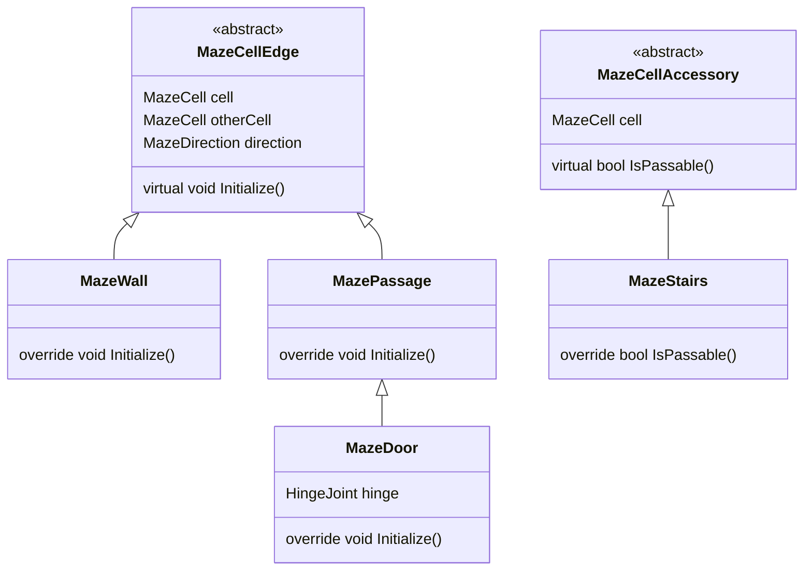
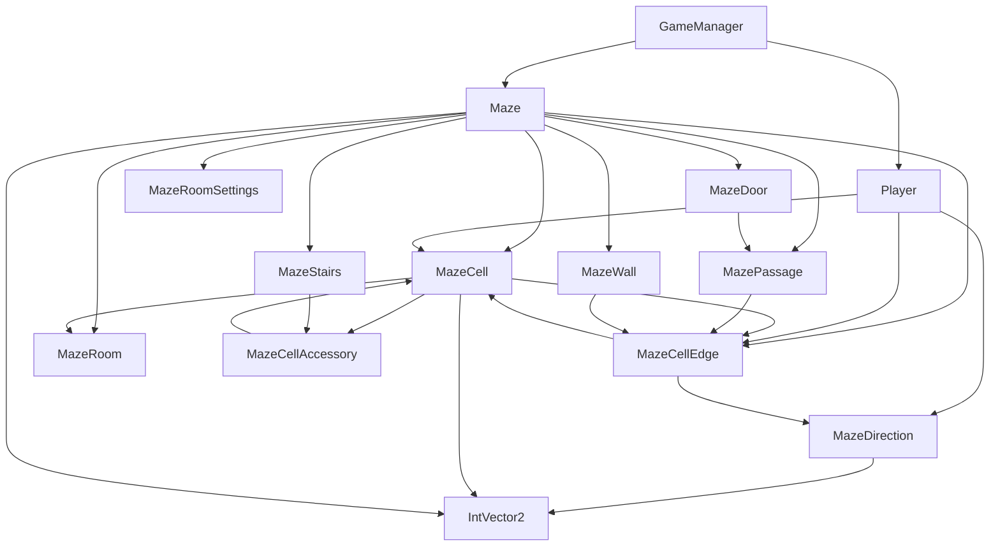
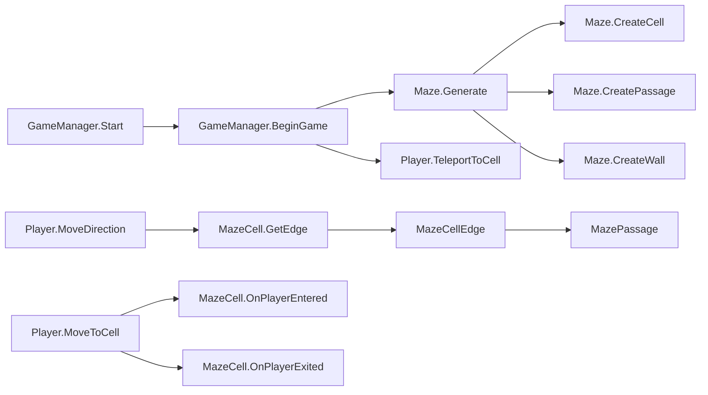

# MazeVenture 代码关系图

## 类继承关系

## 主要类依赖关系

## 游戏流程调用链

## 核心组件说明

1. **基础组件**
   - `IntVector2`: 用于表示二维网格坐标
   - `MazeDirection`: 提供方向枚举及相关工具方法

2. **迷宫结构组件**
   - `MazeCell`: 迷宫单元格，包含坐标、房间号等信息
   - `MazeCellEdge`: 单元格边缘基类，派生出墙体、通道和门
   - `MazeWall`: 不可通行的墙体
   - `MazePassage`: 可通行的通道
   - `MazeDoor`: 可开关的门

3. **迷宫装饰组件**
   - `MazeCellAccessory`: 单元格附件基类
   - `MazeStairs`: 楼梯组件

4. **房间系统**
   - `MazeRoom`: 房间管理类
   - `MazeRoomSettings`: 房间设置类

5. **游戏控制组件**
   - `Maze`: 迷宫生成和管理核心类
   - `Player`: 玩家控制类
   - `GameManager`: 游戏管理器，负责初始化游戏和重启游戏